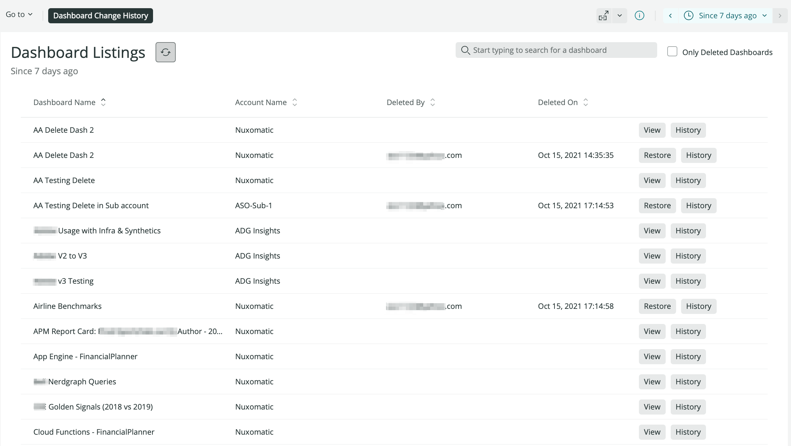

[](https://opensource.newrelic.com/oss-category/#new-relic-experimental)

# NR1 Dashboard History and Restoration

This New Relic One app makes it simple to view the change history of any dashboard in your New Relic accounts, or to restore deleted dashboards.

- [Use Cases](#use-cases)
- [Pre-requisites](#pre-reqs)
- [Installation](#install)
- [Usage](#usage)
- [Issues](#issues)
- [Constraints](#constraints)
- [Security](#security)



## Use Cases <a id="use-cases"></a>

1. Dashboard change history quick view
   You can use this app to access a quick view of a given dashboard's change history, allowing you to understand at a glance what actions have been taken against a dashboard, when and by whom.
2. Rapid dashboard restoration
   While it is possible to locate the GUID of a deleted dashboard and [request an undelete](https://api.newrelic.com/graphiql?#query=mutation%20%7B%0A%20%20dashboardUndelete%28guid%3A%20%22%22%29%20%7B%0A%20%20%20%20errors%0A%20%20%7D%0A%7D%0A) for that GUID, there is no way to see the user-friendly name of a dashboard once it has been deleted. Without access to the dashboard name, it can be extremely difficult to identify the desired dashboard for restoration.
   Using this app persists the mapping of a dasboard GUID to its name, even after it is deleted, allowing for rapid location and restoration.

## Pre-requisites <a id="pre-reqs"></a>

In order to display deleted dashboards in the listing, you will need to have deployed one of the [scripts](synthetics/README.md) found in [the synthetics directory](synthetics). Note that we can only keep track of dashboards that are deleted _after_ the synthetic script is running.

The app will work without a Synthetic script deployed; however, only active dashboards will be displayed.

To build and deploy the app, make sure you have [set up your environment](https://developer.newrelic.com/build-apps/set-up-dev-env/).

## Installation <a id="install"></a>

- Clone the repo
- run `npm install`
- run `nr1 nerdpack:uuid -gf`

Follow these instructions to [test locally](https://developer.newrelic.com/build-apps/publish-deploy/serve/).

Follow these instructions to [publish](https://developer.newrelic.com/build-apps/publish-deploy/publish/) the app to New Relic, and [subscribe](https://developer.newrelic.com/build-apps/publish-deploy/subscribe/) your account to use it.

## Usage Guide <a id="usage"></a>

The app consists of three main components - follow each link for more details:

1. [Dashboard Listing](./docs/dashboard-listings.md)
2. [Restore Workflow](./docs/restore-dashboard.md)
3. [Change History](./docs/change-history.md)

## Issues <a id="issues"></a>

To view a listing of enhancement requests and known bugs - or to request a new feature or report a bug - please visit the repository [issues page](https://github.com/newrelic-experimental/nr1-dashboard-history/issues).

## Constraints <a id="constraints"></a>

### Deleted dashboards availability

Deleted dashboards will only appear in the Dashboard Listings if they are deleted after the Synthetic script is deployed. Dashboards that were deleted before the Synethic was created will not be available for restoration in the app.

Additionally, deleted dashboards entries are stored as custom events. Custom events are retained for a specific period of time (which can be customized) - the default retention period is 30 days. If a dashboard is not restored within the retention period, it will no longer be avialble for restoration via the app. So, assuming the default retention, if you have a dashboard that is deleted on day 1 and is not restored, it will no longer be available for restoration in the app on day 31.

Note that dashboards can still be recovered even if they do not appear in the app - you can do so by leveraging the [dashboard undelete](https://api.newrelic.com/graphiql?#query=mutation%20%7B%0A%20%20dashboardUndelete%28guid%3A%20%22%22%29%20%7B%0A%20%20%20%20errors%0A%20%20%7D%0A%7D%0A) graphql mutation. If you know approximately when or who deleted your dashboard, you can look for the appropriate guid by issuing the following query:

```
FROM NrAuditEvent SELECT targetId, actorEmail WHERE actionIdentifier = 'dashboard.delete' SINCE [your time frame]
```

## Security <a id="security"></a>

New Relic is committed to the privacy and security of our customers and their data; review our [security policy](https://github.com/newrelic-experimental/nr1-dashboard-history/security/policy) for details.
