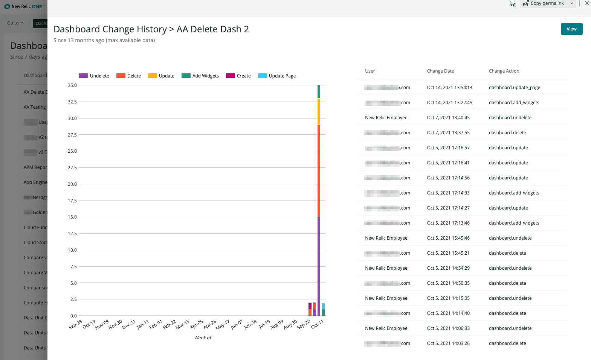

# Dashboard Change History

## Description

The Change History screen is accessed by clicking the `History` button for a given row in the [Dashboard Listings](dashboard-listings.md), and gives you the opportunity to quickly review the entire set of audit events captured for a specific dashboard for the past 13 months (note that 13 months is the maximum period of time that audit events are retained).

This is a straightforward view that shows the change events plotted over time, as well as a tabular listing showing each change action, who performed it, and when.

If you are reviewing an active dashboard, you can also choose to view the dashboard in an overlay.

