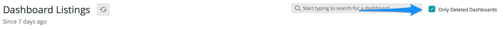

# Dashboard Listings

## Description

This is the app's main view, and consists of a tabular listing that shows:

- all active dashboards (the same listing you would see in NR1 Dashboard)
- all known deleted dashboards

Each row in the table represents a dashboard in your accounts, and includes the name of the dashboard, the account it belongs to, and - if applicable - the specifics of who deleted it and when.

You can take an additional action for each dashboard, depending on its status:

- **history**: Clicking this will open the dashboard's [change history](change-history.md). Available to any dashboard.
- **view**: Clicking this will open the dashboard in a stacked overlay (only active dashboards).
- **restore**: Clicking this will initiate the [restore dashboard](restore-dashboard.md) worklflow (only deleted dashboards).

## Filtering

There a few filtering mechanisms provided to help you fine-tune the scope of data under consideration.

### 1. Change the time period

You can change the time period as you would anywhere else in New Relic One, with the time picker in the upper-right section of the screen.

Note that the time period only impacts on the time period used to locate deleted dashboards; the set of active dashboards will always be those dashboards that are active **now**.

### 2. Show only deleted dashboards

If you need to quickly see any dashboards that are in a deleted state, you can click on the "Show Deleted Only" checkbox to hide any active dashboards from the listing.

### 3. Find a specific dashboard

Finally, if you need to track down a specific dashboard, you can search for that dashboard by name. This will search both active and known deleted dashboards.

Selecting the dashboard will hide all other dashboards from the listing. You can restore the complete listing simply by clicking the 'X' next to the selected dashboard.

