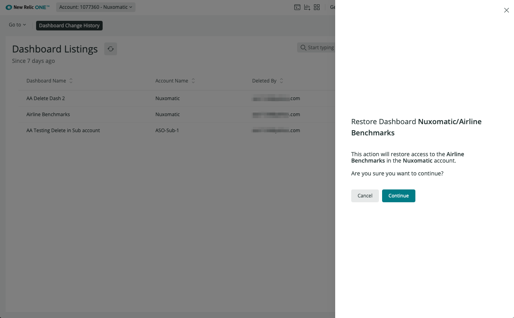

# Restore Dashboard

## Description

The Restore Dashboard workflow is accessed by clicking the `Restore` button for a given row in the [Dashboard Listings](dashboard-listings.md), and gives you the opportunity to restore a deleted dashboard to active status.

This will open a simple modal, asking for confirmation to restore the selected dashboard. If you change your mind, you can cancel the action and return to the Dashboard Listings.

If you select to continue, the dashboard will be restored and will once again be accessible to users in the Dashboards section of New Relic One. You will also see that the dashboard information in the Dashboard Listings is updated to reflect its active status.

